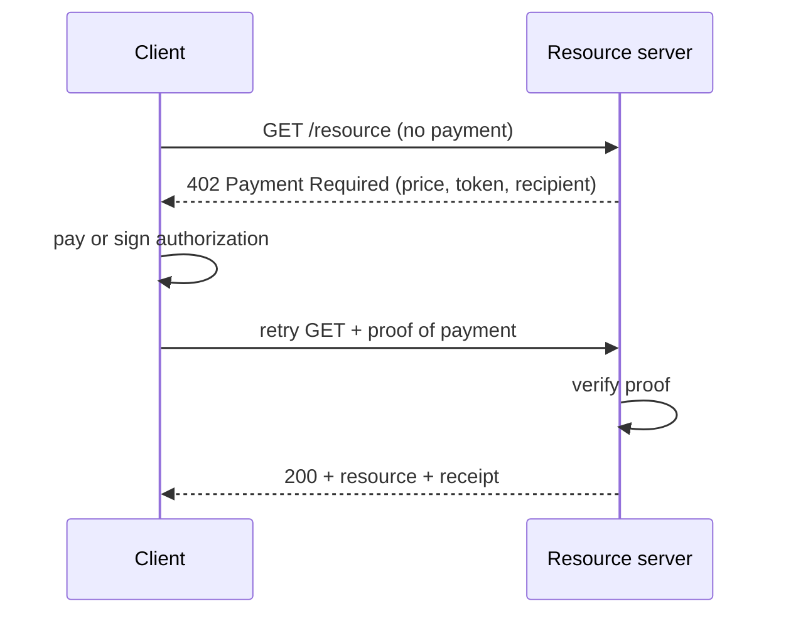
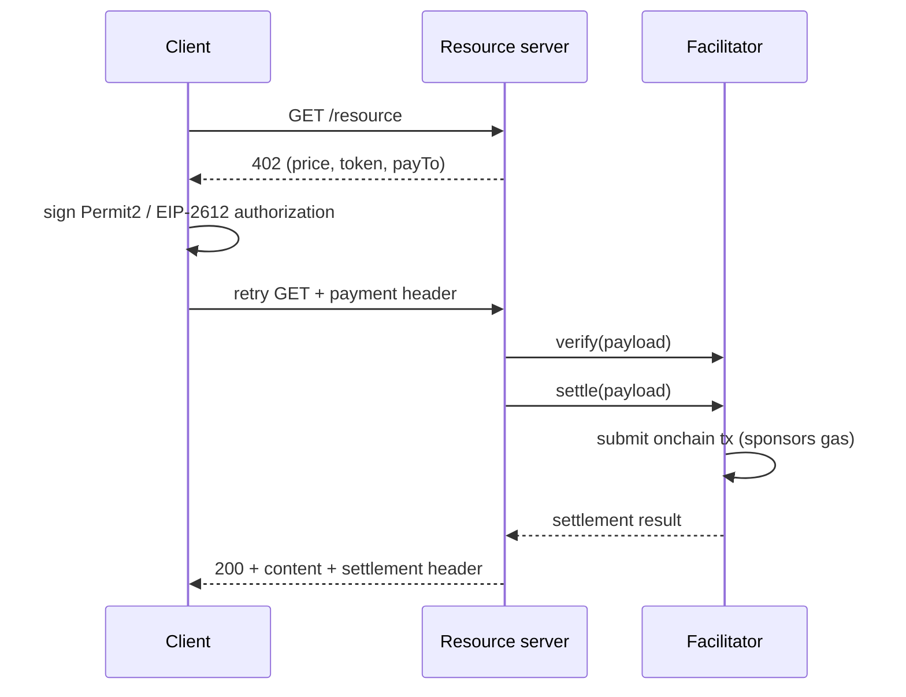
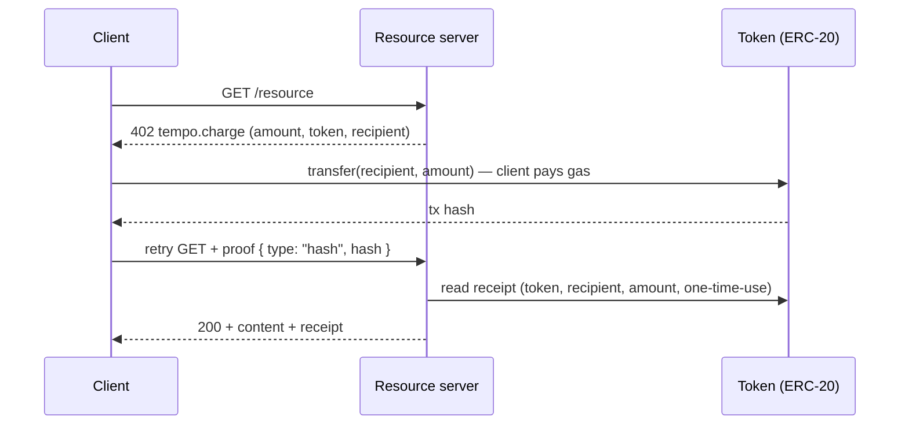
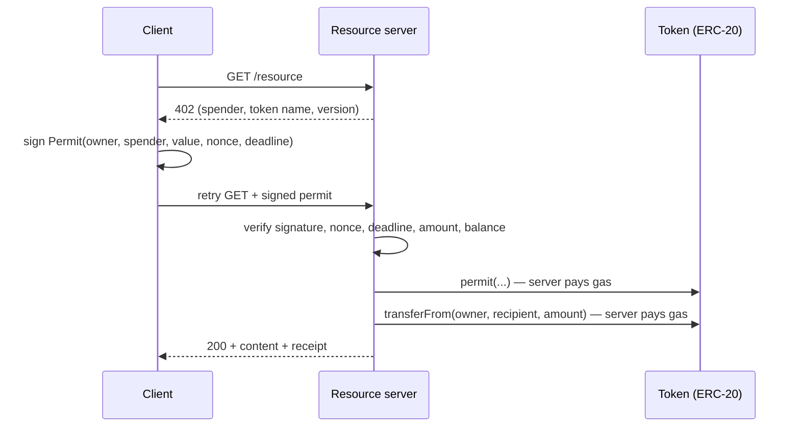
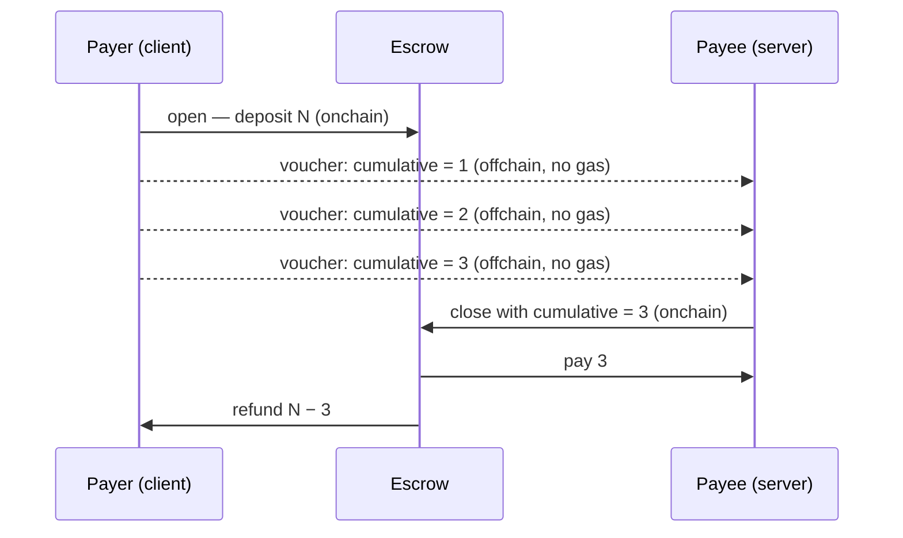
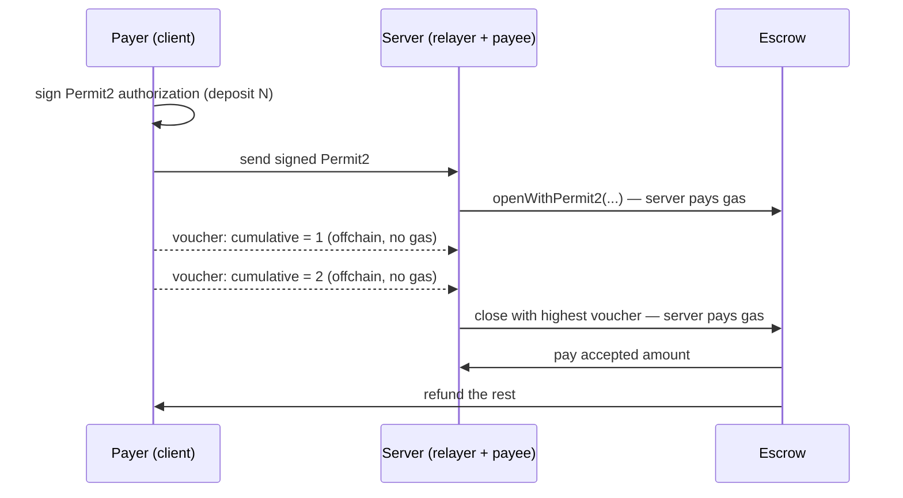

# Onchain Payments

This guide shows how to charge for access to an API, a piece of content, or a metered service in a MegaETH dapp.
It explains the one pattern every approach shares, the two protocol families built on it, and five concrete flows you can pick from.


All five flows run against the same MegaETH Testnet token and are implemented end-to-end in the [MegaETH Payment Demo](https://github.com/megaeth-labs/payment-demo).
This guide explains the mechanisms; the demo is the code.



**Onchain payments can be reorged.**
A payment transaction that looks confirmed — a `transfer`, a `permit` settlement, or a channel `close` — can still be rolled back if the chain reorgs, so its receipt is not final the instant you see it.
Before releasing the paid resource, wait for the level of confirmation your risk tolerance requires rather than trusting a single freshly-seen receipt, and make payment verification **idempotent** so a replayed or re-mined transaction is never double-credited.


## HTTP 402

Every flow in this guide is a variation on the same handshake, built on the long-reserved `402 Payment Required` HTTP status code:

1. The client requests a protected resource with no payment.
2. The server replies `402 Payment Required` with a machine-readable **challenge** describing the price, the token, and the recipient.
3. The client satisfies the challenge — by paying, or by signing an authorization.
4. The client retries the same request, carrying **proof of payment**.
5. The server verifies the proof, serves the resource, and returns a **receipt**.

What changes between flows is only two things: **what counts as proof**, and **who pays the gas** for the onchain payment transaction.
Everything else is the same request/response shape.

## Two protocol families

For dapps, there are two interoperable-by-pattern (but independent) protocol stacks to choose from, each with a Node.js SDK.
They both ride on HTTP 402; they are not extensions of each other.

| Family                                                              | NPM Package | Model it covers                         |
| ------------------------------------------------------------------- | ----------- | --------------------------------------- |
| [**x402**](https://github.com/x402-foundation/x402/tree/main/specs) | `@x402/*`   | One-time payments via a _facilitator_   |
| [**MPP**](https://mpp.dev/overview)                                 | `mppx`      | One-time _and_ pay-as-you-go (channels) |

Think of them like two payment processors that speak the same wire protocol.
x402 is a standards-style one-shot paywall; MPP ([Machine Payments Protocol](https://mpp.dev/overview)) adds streaming/metered billing on top of the same idea.

## The two axes that organize everything

Before the five flows, hold two questions in your head:

- **One-time or streaming?** Charge once per request, or open a channel and bill many requests cheaply?
- **Who pays gas onchain?** The end user, or you (the server) sponsoring it so the user only signs?

The five flows are just the useful points in that 2×2, plus x402 as the standards-based one-time reference.

| #   | Flow                                                                 | Model         | User only signs? (gasless)  |
| --- | -------------------------------------------------------------------- | ------------- | --------------------------- |
| 1   | [x402 exact](#flow-1--x402-exact-payment)                            | one-time      | yes — facilitator sponsors  |
| 2   | [MPP charge (push)](#flow-2--mpp-charge-push-mode)                   | one-time      | no — user sends the payment |
| 3   | [MPP charge (gasless / pull)](#flow-3--mpp-charge-gasless-pull-mode) | one-time      | yes — server pulls funds    |
| 4   | [MPP session (official)](#flow-4--mpp-session-pay-as-you-go)         | pay-as-you-go | no — user funds the channel |
| 5   | [MPP session (gasless)](#flow-5--mpp-session-gasless)                | pay-as-you-go | yes — server relays funding |

## Flow 1 — x402 exact payment

**Use it for:** a standards-based one-time paywall, with gasless onboarding for first-time users.
**Official spec:** [x402 `exact` scheme for EVM](https://github.com/x402-foundation/x402/blob/main/specs/schemes/exact/scheme_exact_evm.md).

The server declares a price in a structured challenge.
The client signs a typed-data payment authorization, and a separate component called a **facilitator** verifies it and settles it onchain.
The facilitator holds a funded key, so it can submit the settlement transaction and **sponsor the gas** — the user never needs the native gas token for their first payment.

1. The client requests the resource and gets a `402` challenge (price, token, `payTo`).
2. The client signs a typed-data payment authorization (Permit2 / EIP-2612) — **no gas**.
3. The client retries the request carrying the payment header.
4. The resource server hands the payload to the **facilitator**, which verifies and settles it onchain — **the facilitator pays gas**.
5. The server returns the content plus a settlement header.

The defining trait is the **facilitator**: the resource server stays thin (it only declares a price and gates content) and delegates all key-holding and onchain work.
The demo runs the facilitator in-process by default, but it can also be a remote service.


x402's gas sponsoring pairs **Permit2** (the transfer rail) with an **EIP-2612 signature** (to set up the Permit2 allowance without a separate gas-paid `approve`).
That combination is what makes a brand-new user's first payment fully gasless.


## Flow 2 — MPP charge, push mode

**Use it for:** the simplest possible one-time payment, with no server key and no sponsorship.
**Official spec:** [MPP `charge` intent](https://mpp.dev/intents/charge).

The client just makes the payment itself and shows the receipt.
This is MPP's official `tempo.charge` intent.

1. The client requests the resource and gets a `tempo.charge` challenge (amount, token, recipient).
2. The client's wallet sends a normal ERC-20 `transfer(recipient, amount)` — **the user pays gas**.
3. The client retries with proof: `{ type: "hash", hash }`.
4. The server verifies that transaction onchain (right token, recipient, amount; one-time-use) and serves the content.

The only onchain interaction is the user's own transfer.
The server never sends a transaction — it just reads the receipt — so this flow needs no server private key.


Push proof is a transaction hash, validated by amount + recipient + one-time-use.
It is not cryptographically bound to a specific request, so use the optional `memo`/`expires` fields (or per-request recipients) if you need tight request-to-payment binding.


## Flow 3 — MPP charge, gasless (pull) mode

**Use it for:** a one-time charge where the user has no native gas token and should only sign.
**Official spec:** [MPP `charge` intent](https://mpp.dev/intents/charge) (this gasless pull is a Permit-based variant of it).

Same one-time charge, but the **server pays gas and pulls the funds**.
The user signs an [EIP-2612](#building-blocks) `permit`; the server submits it and then pulls the payment.

1. The challenge tells the client the spender, token name, and version.
2. The client reads the token nonce and signs `Permit(owner, spender, value, nonce, deadline)`.
3. The client sends the signed permit as proof.
4. The server verifies the signature, nonce, deadline, amount, and balance.
5. The server submits `permit(...)` and then `transferFrom(owner, recipient, amount)` — **the server pays gas for both**.

This is the same user-facing shape as push mode, but the proof is a signature instead of a finished transaction, and settlement moves to the server.
It requires a funded server key.


The official MPP `charge` intent only standardizes **push mode** (Flow 2), where the user sends and pays for the transfer.
This gasless pull variant is a **demo extension**: it adds an [EIP-2612](#building-blocks) `permit` + `transferFrom` settlement path so the server can pull the funds and pay the gas.
It is not part of the official spec.


## Flow 4 — MPP session (pay-as-you-go)

**Use it for:** high-frequency or metered billing — pay per API call, per inference, per request — where one transaction per payment would be too slow and too expensive.
**Official spec:** [MPP `session` intent](https://mpp.dev/intents/session).

This is a **unidirectional payment channel**.
The client deposits once into an onchain escrow contract, then pays for each request with a cheap **offchain signed voucher** that carries a running total (i.e., accumulated costs).
Only three moments ever touch the chain — opening the channel, topping it up, and closing it to settle — while paying for each individual request is a pure offchain signature.
The steps below name the concrete operations: `open`, `topUp`, and `close` are functions on the escrow contract, while the per-request `voucher` is an offchain signature.

1. The client `open`s the channel, depositing `N` into the escrow — **client pays gas**.
2. For each request, the client signs an offchain `voucher` carrying the new **cumulative** total — **no gas**.
3. The server serves each request, remembering only the single highest voucher per channel.
4. When the deposit runs low, the client `topUp`s more — **client pays gas**.
5. To settle, the server `close`s with the highest voucher; the escrow pays the payee that amount and refunds the rest — **server pays gas**.

The four actions:

| Action    | Initiated by (pays gas) | Tx recipient                | Fund flow                                                          | Onchain?          | Purpose                                   |
| --------- | ----------------------- | --------------------------- | ------------------------------------------------------------------ | ----------------- | ----------------------------------------- |
| `open`    | client                  | escrow contract             | client → escrow (deposit `N`)                                      | yes (client gas)  | deposit, create channel, sign 1st voucher |
| `voucher` | client (signs only)     | — (sent to server offchain) | none — promises a cumulative amount                                | **no** — gas-free | pay for one request                       |
| `topUp`   | client                  | escrow contract             | client → escrow (add deposit)                                      | yes (client gas)  | add deposit when it runs low              |
| `close`   | server (payee)          | escrow contract             | escrow → payee (highest voucher); escrow → payer (refund the rest) | yes (server gas)  | settle highest voucher, refund the rest   |

The key invariant: vouchers carry a **cumulative** total, so the server only ever needs to remember the single highest voucher per channel.
On `close`, the escrow pays the payee that highest amount and refunds the unused deposit to the payer.


The server settles on the highest voucher it has accepted, so that per-channel state must be **durable and concurrency-safe** in production.
Use a shared store (not in-process memory) across serverless instances, and guard the voucher update with an atomic compare-and-swap so concurrent requests on one channel cannot be double-served.


## Flow 5 — MPP session, gasless

**Use it for:** the same metered billing as Flow 4, but with a zero-gas experience — the user only ever signs.
**Official spec:** [MPP `session` intent](https://mpp.dev/intents/session) (this gasless variant relays funding via Permit2).

The channel model, vouchers, and `close` are identical to Flow 4.
The only difference is **who funds the channel onchain**: instead of the client sending `open`/`topUp` transactions, the client signs a **Permit2** authorization and the **server relays** the funding.

1. The client signs a **Permit2** authorization to fund the channel instead of sending `open` — **no gas**.
2. The server relays it via `openWithPermit2`, opening the channel onchain — **server pays gas**.
3. For each request, the client signs an offchain cumulative `voucher` — **no gas** (identical to Flow 4).
4. To add funds, the client signs another Permit2 and the server relays `topUpWithPermit2` — **server pays gas**.
5. The server `close`s with the highest voucher; the escrow pays the payee and refunds the rest — **server pays gas**.

The four actions:

| Action             | Initiated by (pays gas)              | Tx recipient                | Fund flow                                                          | Onchain?          | Purpose                                         |
| ------------------ | ------------------------------------ | --------------------------- | ------------------------------------------------------------------ | ----------------- | ----------------------------------------------- |
| `openWithPermit2`  | server relays (client signs Permit2) | escrow contract             | client → escrow (deposit `N`, pulled via Permit2)                  | yes (server gas)  | fund + create channel, client signs 1st voucher |
| `voucher`          | client (signs only)                  | — (sent to server offchain) | none — promises a cumulative amount                                | **no** — gas-free | pay for one request                             |
| `topUpWithPermit2` | server relays (client signs Permit2) | escrow contract             | client → escrow (add deposit)                                      | yes (server gas)  | add deposit when it runs low                    |
| `close`            | server (payee)                       | escrow contract             | escrow → payee (highest voucher); escrow → payer (refund the rest) | yes (server gas)  | settle highest voucher, refund the rest         |

The contrast with Flow 4 is only **who sends the funding transaction** — the client signs instead of sending, and the server relays:

| Phase     | Flow 4 (official)           | Flow 5 (gasless)                |
| --------- | --------------------------- | ------------------------------- |
| `open`    | client calls escrow `open`  | server calls `openWithPermit2`  |
| `topUp`   | client calls escrow `topUp` | server calls `topUpWithPermit2` |
| `voucher` | offchain signature          | offchain signature (identical)  |
| `close`   | server settles              | server settles (identical)      |

Because a relayer (the server), not the payer, sends the funding transaction, the escrow needs entry points where the payer is authorized by **signature** rather than by being `msg.sender`.
That is exactly what **Permit2** and **EIP-3009** provide, and why the gasless flow uses an escrow variant with signature-authorized funding methods (`*WithPermit2` and `receiveWithAuthorization`).


The official MPP `session` spec defines only the **base escrow**, funded by the client's own `open`/`topUp` transactions — it has **no gasless funding path**.
This gasless flow is a **demo extension**: the escrow variant adds signature-authorized funding entry points — `*WithPermit2` ([Permit2](#building-blocks)) and `receiveWithAuthorization` ([EIP-3009](#building-blocks)) — so a relayer can fund on the payer's behalf.
It is not part of the official spec.


## Choosing a flow

Start from the two axes:

| If you need…                                     | Use           |
| ------------------------------------------------ | ------------- |
| A standards-based one-time paywall               | Flow 1 (x402) |
| The simplest one-time charge, no server key      | Flow 2        |
| A one-time charge with zero gas for the user     | Flow 3        |
| Metered/streaming billing, user pays gas         | Flow 4        |
| Metered/streaming billing, zero gas for the user | Flow 5        |


Gasless flows (1, 3, 5) trade a little server cost and a funded relayer key for a much smoother user experience: the user never needs the native gas token and only signs.
Non-gasless flows (2, 4) are simpler to operate because the user pays their own gas.


## Building blocks

These primitives recur across the flows.
Each lets someone authorize a token movement with a **signature** instead of a pre-sent `approve` transaction — the foundation of every gasless flow.

- **EIP-2612 `permit`** — a token-native signed approval (`Permit(owner, spender, value, nonce, deadline)`). Works only if the token implements it. Used in Flows 1 and 3.
- **Permit2** — a single canonical contract (deployed at the same address on every chain) that adds signature-based transfers to _any_ ERC-20 after a one-time `approve(Permit2)`. Its **witness** data binds an authorization to specific terms, preventing reuse on a different channel. Used in Flows 1 and 5.
- **EIP-3009 `receiveWithAuthorization`** — a token-native signed transfer with arbitrary (non-sequential) nonces, enabling concurrent authorizations. Supported by the escrow as an alternative funding path.
- **Payment channel + voucher** — an onchain escrow settled by cumulative offchain signatures. The core of Flows 4 and 5.

## MegaETH-specific payment demo

The [MegaETH Payment Demo](https://github.com/megaeth-labs/payment-demo) implements all five flows against MegaETH Testnet, with a connected wallet on the client and a relayer/facilitator on the server.

| Flow | Protected route                 | Demo UI component        |
| ---- | ------------------------------- | ------------------------ |
| 1    | `GET /api/x402/exact`           | `X402Demo`               |
| 2    | `GET /api/mpp/charge`           | `MppDemo`                |
| 3    | `GET /api/mpp/gasless-charge`   | `MppGaslessDemo`         |
| 4    | `POST /api/mpp/session`         | `MppOfficialSessionDemo` |
| 5    | `POST /api/mpp/session-gasless` | `MppSessionGaslessDemo`  |

The repository also includes the escrow contract (`contract/`) and protocol scheme notes (`docs/`) explaining each flow in more detail.

**Notes:**

- **Token.** The demo uses a testnet USD-style ERC-20 (USDm) as the payment asset across all five flows.
- **Escrow.** The session flows use a `TempoStreamChannel`-style escrow deployed on MegaETH; the gasless variant adds Permit2 / EIP-3009 funding entry points so a relayer can fund on the payer's behalf.
- **Fast settlement.** Server-side settlement (gasless charge, channel `close`, relayed funding) is submitted via MegaETH's realtime transaction RPC, which returns a receipt synchronously instead of requiring a separate poll. See [`realtime_sendRawTransaction`](read/rpc/realtime_sendRawTransaction.md) and the [Realtime API](read/realtime-api.md).
- **Gas.** Sponsored flows require a funded server key to pay gas. Estimate gas with `eth_estimateGas` against a MegaETH endpoint rather than computing it manually — see [Gas Estimation](send-tx/gas-estimation.md).

## Further reading

- [MegaETH Payment Demo](https://github.com/megaeth-labs/payment-demo) — runnable Next.js app implementing all five flows
- [x402 specification](https://github.com/x402-foundation/x402/tree/main/specs) — the official x402 protocol spec ([repo and packages](https://github.com/x402-foundation/x402))
- [MPP specification](https://mpp.dev/overview) — the official Machine Payments Protocol spec, built on the [Payment HTTP authentication scheme](https://paymentauth.org) ([`mppx` SDK](https://github.com/wevm/mppx))
- [Realtime API](read/realtime-api.md) — synchronous transaction submission on MegaETH
- [EIP-2612](https://eips.ethereum.org/EIPS/eip-2612) · [EIP-3009](https://eips.ethereum.org/EIPS/eip-3009) · [Permit2](https://github.com/Uniswap/permit2)
